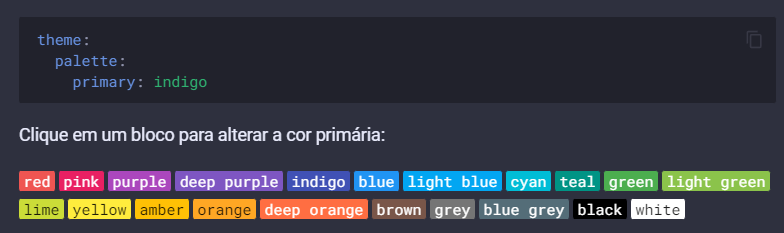

# Bem vindo
## Os links disponibilizados vai ajudar a prosseguir com a documentação

###Comandos para fazer Deploy do Mkdocs

```{.py3 hl_lines="1 3  10" linenums="1" title="Comandos.md"}
Usar: mkdocs [Opções] Commando [Argumento]....

	MkDocs - Projecto documento em Markdown.
Opções:
	-V, --version  Mostrar a version ou saida.
	-q, --quiet    Silenciar os alarmes
	-v, --verbose  Habilitar saída detalhada
	-h, --help	   Mostre esta mensagem e saia.

Comandos:
	build		   Construir a documentação do mkdocs
	gh-deploy	   Implante sua documentação no Github Pages
	new		       Criar uma nova pagina Mkdocs Projeto
	serve		   Execute o servidor de desenvolvimento integrado

```


###[Extensão do Python Docs](https://facelessuser.github.io/pymdown-extensions/)


###[Comandos para utilizar Sintaxe Básica do Mkdocs](https://www.markdownguide.org/cheat-sheet/)


###[Configurando e mudando formas e cores](https://squidfunk.github.io/mkdocs-material/setup/changing-the-colors/)


###[Mermaid permite criar diagramas e visualizações usando texto e código.](https://mermaid-js.github.io/mermaid/#/)


<script src="//cdn.ckeditor.com/4.19.0/standard/ckeditor.js"></script>

<!DOCTYPE html>
<html lang="en">
    <head>
        <meta charset="utf-8">
        <title>A Simple Page with CKEditor 4</title>
        <!-- Make sure the path to CKEditor is correct. -->
        <script src="../ckeditor.js"></script>
    </head>
    <body>
        <form>
            <textarea name="editor1" id="editor1" rows="10" cols="80">
                This is my textarea to be replaced with CKEditor 4.
            </textarea>
            <script>
                // Replace the <textarea id="editor1"> with a CKEditor 4
                // instance, using default configuration.
                CKEDITOR.replace( 'editor1' );
            </script>
        </form>
    </body>
</html>
